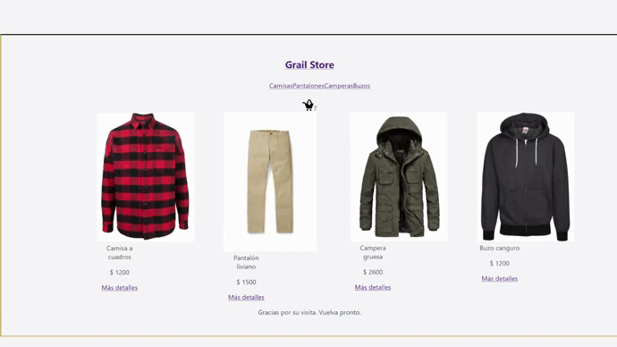

# Grail E-Commerce
## _Funcionamiento_

Para comenzar a utilizarlo se debe clonar [este repositorio.](https://github.com/johnatan-ferre/react)\
Luego se debe ejecutar `npm install`

Se hace de la siguiente manera:

```bash
$ git clone https://github.com/johnatan-ferre/react.git
$ cd grailecommerce
$ npm install
$ npm start
```


### En el proyecto se puede utilizar:

### `npm start`

Da inicio a la ejecución de la aplicación.\
Abre un [servidor local](http://localhost:3000) en el navegador.

La página recarga cada vez que se realizan cambios.

## _Variables de Entorno_

Ver [`.env.example`]()

## _La aplicación contiene las siguentes vistas_

- En la ruta ' / ' se monta el componente _ItemListContainer_, que carga un listado de productos.\
Las cards que contienen la información de los productos tiene un botón para ver más detalles.

- En la ruta ' /item/:id ' se monta el componente _ItemDetailContainer'_, que muestra el detalle de un solo producto.

- En la ruta ' /category/:catId ' se monta el _ItemListContainer_, pero en este caso se hace un filtrado según lo que se quiera buscar.



## _Se utiliza Firebase_

- Se implementa para el backend.
- Se usa la base de datos Firestore.
